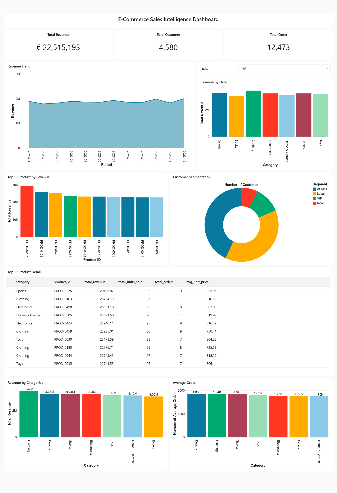
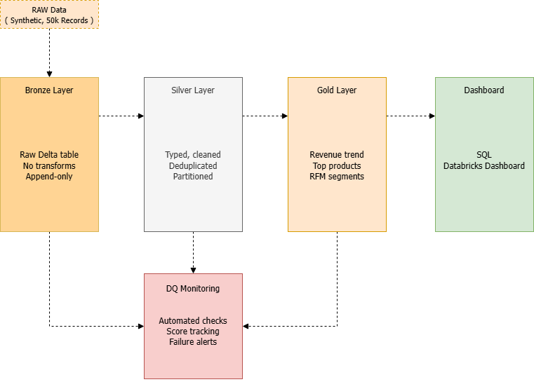

# E-Commerce Sales Pipeline — Databricks Medallion Architecture


> End-to-end batch data pipeline built on **Databricks**, demonstrating production-grade
> data engineering patterns using **Medallion Architecture** (Bronze → Silver → Gold),
> automated **data quality monitoring**, and an interactive **SQL dashboard**.
>
> Built to reflect real-world fintech/banking data engineering workflows —
> where data reliability, auditability, and traceability are non-negotiable.

---

## Dashboard Preview

<!-- Drag & drop screenshot kamu di sini via GitHub editor -->


*E-Commerce Sales Intelligence Dashboard — built on Databricks SQL*

---

## Architecture

```

```

**Tech stack:** Databricks · PySpark · Delta Lake · Databricks SQL · Python 3.10+

---

## Why This Matters in Fintech / Banking Context

In financial services, data pipelines must be:

- **Auditable** — Bronze layer preserves raw data exactly as received, enabling full lineage tracing
- **Reliable** — automated data quality checks halt the pipeline if thresholds are breached
- **Idempotent** — all writes use `overwrite` mode, safe to re-run without duplicate records
- **Compliant-ready** — strict type enforcement and null checks mirror financial data governance requirements (e.g. GDPR, BCBS 239)

This project demonstrates these principles end-to-end.

---

## Project Structure

```
databricks-ecommerce-pipeline/
├── notebooks/
│   ├── 01_bronze_ingest.py          # Raw ingestion → Delta (no transforms)
│   ├── 02_silver_transform.py       # Typing, cleaning, deduplication, partitioning
│   ├── 03_gold_aggregate.py         # Revenue aggregation, top products, RFM segmentation
│   ├── 04_sql_dashboard_queries.sql # 9 Databricks SQL dashboard queries
│   └── 05_data_quality_checks.py    # Automated DQ monitoring with historical tracking
├── assets/
│   └── dashboard-preview.png        # Dashboard screenshot
└── README.md
```

---

## Notebooks Overview

| # | Notebook | Layer | Key Operations |
|---|---|---|---|
| 01 | `bronze_ingest.py` | Bronze | Generate 50k synthetic orders, write raw to Delta |
| 02 | `silver_transform.py` | Silver | Cast types, derive columns, filter invalids, deduplicate, partition |
| 03 | `gold_aggregate.py` | Gold | Monthly revenue by category, top products, RFM customer segmentation |
| 04 | `sql_dashboard_queries.sql` | Dashboard | KPI cards, revenue trend, category breakdown, customer segments |
| 05 | `data_quality_checks.py` | Monitoring | 7 automated checks per layer, score tracking, pipeline halt on failure |

---

## Data Quality Framework

Each pipeline run executes automated checks and records results to a Delta monitoring table.

| Check Type | Description | Example Rule |
|---|---|---|
| Row count | Table must not be empty or too small | `>= 40,000 rows` |
| Null check | Critical columns must have no nulls | `order_id IS NOT NULL` |
| Uniqueness | Primary keys must be unique | `order_id` has 0 duplicates |
| Value range | Numeric columns within expected bounds | `unit_price BETWEEN 0.01 AND 10,000` |
| Allowed values | Categorical columns match defined domain | `status IN (completed, cancelled, ...)` |
| Freshness | Data is not stale | Latest record `<= 400 days old` |

Pipeline **halts automatically** if overall DQ score drops below **80%**, preventing bad data from propagating downstream.

---

## Data Model

### Silver — `silver_orders` (partitioned by year/month)

| Column | Type | Description |
|---|---|---|
| `order_id` | string | Unique order identifier (PK) |
| `customer_id` | string | Customer reference |
| `product_id` | string | Product reference |
| `category` | string | Product category |
| `unit_price` | decimal(10,2) | Price per unit |
| `quantity` | integer | Units ordered |
| `total_amount` | decimal(10,2) | Derived: `unit_price × quantity` |
| `order_datetime` | timestamp | Typed from raw string |
| `order_date` | date | Date part of `order_datetime` |
| `order_year` | integer | Partition key |
| `order_month` | integer | Partition key |
| `order_quarter` | integer | Quarter (1–4) |
| `is_weekend` | boolean | True if Saturday or Sunday |
| `status` | string | `completed / cancelled / returned / pending` |
| `postal_code` | string | German postal code |

### Gold Tables

| Table | Granularity | Use Case |
|---|---|---|
| `gold_monthly_revenue` | Month × Category | Revenue trend, category performance |
| `gold_top_products` | Product | Product ranking, pricing analysis |
| `gold_customer_segments` | Customer | RFM segmentation (VIP / Loyal / New / At Risk) |
| `dq_results` | Check × Run | Pipeline health monitoring |

---

## How to Run

**Requirements:** Databricks account (Community Edition is sufficient)

**Step 1 — Import notebooks**
```
Databricks Workspace → Import → upload each .py file from /notebooks
```

**Step 2 — Attach cluster**
```
DBR 13.x or later (Python 3.10+)
```

**Step 3 — Run in order**
```
01_bronze_ingest.py
      ↓
02_silver_transform.py
      ↓
03_gold_aggregate.py
      ↓
05_data_quality_checks.py
```

**Step 4 — Set up SQL Dashboard**
```
Databricks SQL → Dashboards → Create Dashboard
Copy each query block from 04_sql_dashboard_queries.sql
Add visualizations: Line Chart, Bar Chart, Donut, Counter, Table
```

---

## Key Engineering Decisions

**Medallion Architecture** — clear separation of raw, cleaned, and business-ready data. Mirrors patterns used at N26, Zalando, HelloFresh, and major European banks.

**Delta Lake** — ACID transactions, time travel, and schema enforcement. Enables point-in-time recovery and full audit trail — critical in regulated industries.

**Partitioning strategy** — Silver partitioned by `order_year` + `order_month`, reducing query scan cost significantly for time-range filters.

**Idempotent writes** — `mode("overwrite")` with `overwriteSchema=true` ensures safe re-runs without data duplication.

**Automated DQ with historical tracking** — quality scores stored as Delta records, enabling trend analysis of data health over time.

**Fail-fast pattern** — pipeline raises exception if DQ score < 80%, preventing bad data from reaching Gold layer and downstream consumers.

---

## Skills Demonstrated

`PySpark` · `Delta Lake` · `Databricks SQL` · `Advanced SQL` · `Medallion Architecture` ·
`Data Quality Engineering` · `RFM Segmentation` · `ETL/ELT` · `Data Modeling` ·
`Pipeline Monitoring` · `Python OOP` · `Data Governance`

---

## Author

**[Miqdad]**
Data Engineer · [https://www.linkedin.com/in/ahmad-miqdad-m-67a00b107/] · [miqdad.ahmd@gmail.com]

---

*Dataset is fully synthetic — generated programmatically within the pipeline.
No external data sources or API keys required.*
